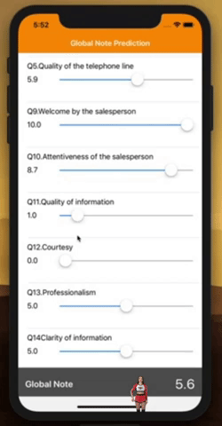

# analyse-to-ios
This repo contains the (Jupyter) notebook demonstrating connection to an instance of AskiaAnalyse using the data to train a scikit-learn RandomForestRegressor
and use it inside an iOS app with CoreML

See this [post](https://blog.askia.com/askiaanalysis/pragmatic-machine-learning---from-analyse-to-ios/) for a description

